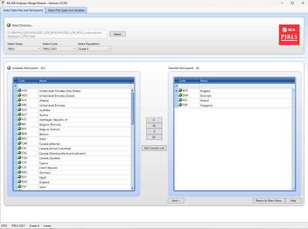
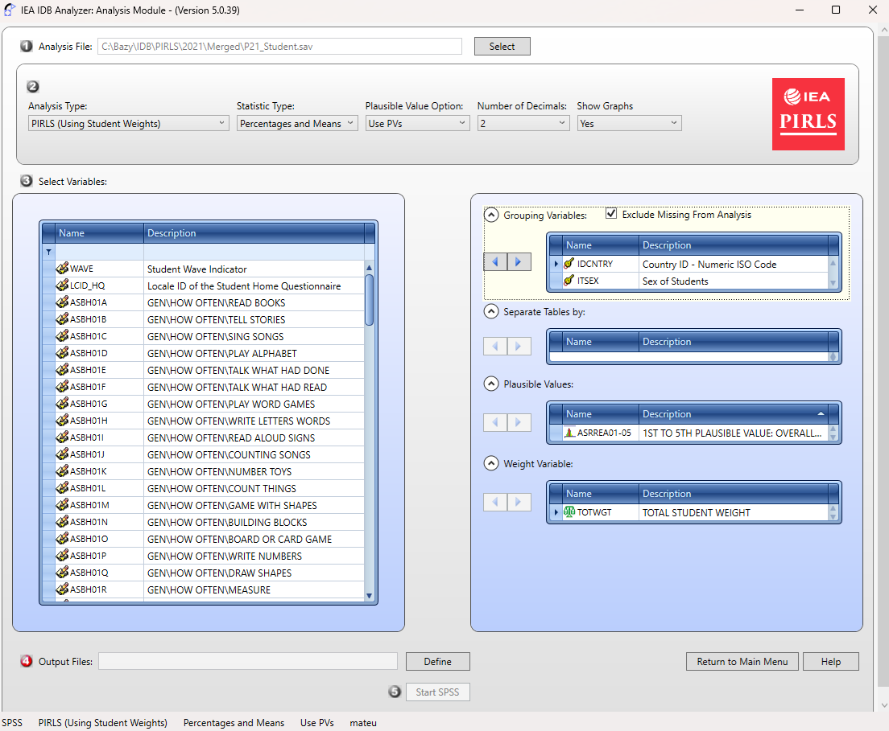
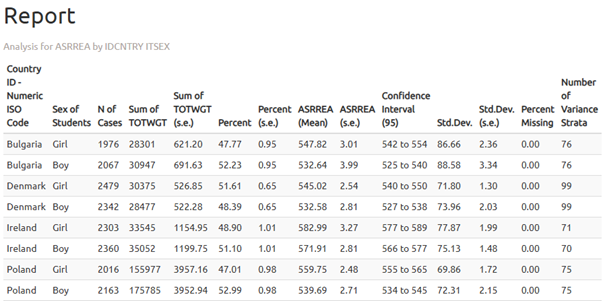
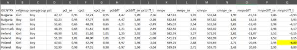

```{=latex}
\newpage
```
## What is the IDB Analyzer?

The IDB Analyzer is a free tool developed by the International Association for the Evaluation of Educational Achievement (IEA) for working with data from international educational assessments conducted by IEA and the Organisation for Economic Co-operation and Development (OECD). It offers an intuitive interface that facilitates working with data without the need for advanced programming knowledge.

**Key features of the IDB Analyzer include:**

- **Generating Analytical Code**: Automatically creates scripts in SPSS, SAS, or R taking into account the IEA and OECD research methodologies, including statistical weights, random sampling and plausible values (PVs).
- **Data Integration**: Allows various types of data files to be combined (e.g., regarding students, teachers, schools, or parents) from multiple countries into a single cohesive dataset.
- **Data Preparation for Analysis**: Enables the selection of specific variables and the creation of customized datasets ready for further statistical processing.
- **Statistical Analysis**: Allows the calculation of statistics such as means, percentages, percentiles, correlations, regression coefficients, and percentages of students achieving specific skill levels (benchmarks).
- **Data Format Conversion**: Enables the transformation of databases from the `.sav` format (SPSS) to `.RData` format (R), facilitating work within the R environment.

::: {.callout-important}
## Important Information About the Program's Operation

The IEA IDB Analyzer does not perform analyses independently - it generates ready-to-use code that must be run in the selected statistical environment (SPSS, SAS or R). Version 5.0 of the IEA IDB Analyzer requires R software (version 4.2.0 or newer), SPSS or SAS.
:::

::: {.callout-tip}
## Additional Resources

- The IEA IDB Analyzer is available for download from the [IEA Data and Tools](https://www.iea.nl/data-tools/tools) website.

- Detailed documentation, including a user manual, can be found in the application interface under the "Help" button.

- The [Educational Research Institute - National Research Institute ](https://ibe.edu.pl/pl/miedzynarodowe-badania-edukacyjne-zasoby/filmy-instruktazowe) website features instructional videos (prepared in Polish) demonstrating how to use the IEA IDB Analyzer package to analyze data from international studies.
:::
```{=latex}
\newpage
```
### Supported Studies

The IEA IDB Analyzer supports data from a range of international educational studies conducted by IEA, OECD, UNESCO, and other organizations. Depending on the project, both data merging and statistical analysis are possible. Three environments are supported: SPSS, SAS, and R.


| Study / Organization | Service Type | SPSS | SAS | R |
|----------------------|-------------|------|-----|---|
| TIMSS / PIRLS / ICILS / ICCS (IEA) | Data Merging and Analysis | ✔ | ✔ | ✔ |
| TALIS / PIAAC / PISA (OECD) | Analysis | ✔ | ✔ | ✔ |


### Downloading Data

Data and documentation (e.g., descriptions of dataset names and variables) from the studies are available on the following websites:

- **PISA**: [www.oecd.org/pisa/data](https://www.oecd.org/pisa/data)
- **TIMSS, PIRLS, ICCS, ICILS**: [www.iea.nl/data-tools/repository](https://www.iea.nl/data-tools/repository)
- **PIAAC**: [www.oecd.org/skills/piaac/data](https://www.oecd.org/skills/piaac/data)
- **TALIS**: [www.oecd.org/en/about/programmes/talis](https://www.oecd.org/en/about/programmes/talis.html#data)

```{=latex}
\newpage
```
### System Requirements, Installation, and Launching the Program:

::: {.callout-note}
## System Requirements

Using the program requires:

- **Operating System**: Windows 10 or 11
  - macOS users can only use the program via a virtual machine with Windows installed (e.g., Parallels Desktop or VirtualBox)
- **An installed analytical environment**:
  - IBM SPSS Statistics
  - SAS
  - R (version 4.2.0 or later) with RStudio
- **Access to Databases**: downloaded to the disk in `.sav`, `.sas7bdat`, or `.RData` format from the IEA Data and Tools Repository or the OECD website.
:::

#### Program Installation

1. Download the latest version of the installer from: https://www.iea.nl/data-tools/tools 

{fig-align="center"}

2. Save the installation file to any folder and run the installer as an administrator
3. Follow the installation process, keeping the default settings.
4. Once installation is complete, launch the program: Start Menu → IEA → IEA IDB Analyzer.

#### Launching the Application and Available Modules

Upon launching the program, the main screen will appear allowing you to select your statistical environment: SPSS, SAS, or R.

{fig-align="center"}

Depending on the selected environment, three modules are available:

- **Convert Module** - available when R is selected, it allows converting `.sav` files to `.RData` format.
- **Merge Module** - used for merging data from different files, which usually correspond to different tools/databases from a given study (e.g., students, teachers, schools) or databases from several countries within a given study.
- **Analysis Module** -  allows preparing scripts or syntaxes for data analysis (in SPSS, SAS, or R).

```{=latex}
\newpage
```

::: {.callout-tip}
## Recommended workflow

Usually, you start with the **Merge Module** and then move on to the **Analysis Module**. When working in R, you may need to first use the **Convert Module** to convert the data files to a format supported by RStudio.
:::

Additionally, the following buttons are available on the home screen:

- **View the Help Manual** - opens the user manual.
- **Access the Sample Files** - allows you to download sample data.
- **Exit** - closes the program.

## Program Modules

The IEA IDB Analyzer consists of three modules that together enable the full cycle of preparing and analyzing data from international educational studies: from file conversion, to merging, to generating analytical code.

### Convert Module

The Convert Module is used for converting data files in `.sav format` (SPSS) to `.RData format` (R), which is required for further analysis in the R environment. This is the first step if you plan to conduct analyses in R and the databases you have are in `.sav` format.

**Module functions:**

- Automatic detection of all `.sav` files in the specified source directory
- Generation of a script to convert SPSS data to R
- Conversion of variables, preserving the labels for names and values
- Saving the output files to the destination folder and opening the completed script in RStudio or another editor

::: {.callout-warning}
## Requirements and Recommendations

- All variables must have labels assigned; otherwise, errors may occur
- It is recommended to keep source and output files in separate folders
- R and RStudio must be installed.
:::

```{=latex}
\newpage
```
**Usage steps:**

{fig-align="center"}

1. Launch the program and select the "R" environment
2. Click the "Convert Files from SPSS to R" button
3. Specify the source directory containing the `.sav` files
4. Specify the target directory where the `.RData` files should be saved
5. Define the name of the conversion script
6. Click "Convert" and run the generated conversion script in RStudio

### Merge Module

The Merge Module is used for combining data from multiple countries and different levels and sources (e.g., students, teachers, schools), creating a single coherent dataset ready for analysis. The program automatically generates code in the selected language (SPSS, SAS, or R) that enables the creation of an integrated data file according to the user's configuration.

**Main Functions of the Module:**

- Merging data from multiple countries participating in the study
- Integrating files from different respondent types (e.g., students, schools, teachers)
- Selecting variables for analysis – the ability to limit the number of variables in the created dataset
- Editing the country list (changing labels, adding or removing items)

::: {.callout-warning}
## Limitations and notes

- The module supports only one study edition at a time (e.g., PIRLS 2016). To merge data from different cycles (e.g., PIRLS 2011 and 2016), datasets must be prepared outside the program (instructions on how to do this are often provided in the technical reports of the study data)
- In the R environment, the Merge Module uses the `left_join()` function from the `dplyr` package. To maintain compatibility, it is recommended to use the same method when combining data outside the program
- The program identifies files based on their names, which must follow predefined patterns. Therefore, the output file should not be saved in the same folder as the source files, as this may lead to errors
- Files must contain variable and value labels (especially important in the R environment), and the file structure must be consistent across countries
:::

**Usage steps:**

1. **Launch the program** and select the statistical environment (SPSS, SAS, or R). Go to the Merge Module tab

2. **Select the data folder**: Choose the folder containing the previously downloaded data files from the selected study. All files must be in the same folder. The program will automatically recognize the study, cycle, and population, displaying a list of available countries

3. **Select Countries for Analysis**: From the Available Participants list, select countries by clicking them and moving them to the Selected Participants panel using the arrow key (→) or double-clicking. To select multiple countries, hold down the Ctrl key. Use the arrow key (→|) to select all countries

{fig-align="center"}

4. **(Optional)** Click Edit Country List to edit country labels by adding or removing items (each must include a 3-letter code, ISO code, and full name).

5. **Select data file types**: Click Next to go to the Select File Types and Variables tab. Check the boxes next to the data types you want to include, such as School Context, Student Achievement, Student Context, Student Home, Teacher Context.

::: {.callout-important}
To combine data of different types, such as student data with parent, school, or teacher data, select the appropriate file types. Ensure that the data is combined in accordance with the study's methodology, as some data types (e.g., teacher data) require analysis in relation to student data. Consult the study's technical documentation (e.g., in the Help manual) to determine how to properly merge data and interpret the results.
:::

```{=latex}
\newpage
```

6. **Select variables**: From the Available Variables list, choose variables for analysis by moving them to the Selected Variables panel using the arrow (→). Use the arrow (→|) to select all variables. Some variables (identification and analysis variables) are automatically selected by default

{fig-align="center"}

7. **Specify save location**: In the Output Files field, click Define to specify the folder and file name for the output file and script. The file name cannot contain special characters

8. **Generate and run the script**: Click Start SPSS/SAS/R to generate the script. Run it in the selected statistical environment (in R, click Source or press Ctrl + Shift + Enter; in SPSS choose Run > All; in SAS click Run or Submit)

```{=latex}
\newpage
```

### Analysis Module

The Analysis Module is a key component of the IEA IDB Analyzer, which enables the generation of ready-made analytical scripts in SPSS, SAS or R. The module is designed for analyzing data from international educational studies, taking into account their complex sampling design, including sampling weights, replication weights and plausible values (PVs).

::: {.callout-note}
## Analysis Methodology

The program automatically uses the jackknife Repeated Replication (JRR) or Balanced Repeated Replication (BRR) method, allowing for the correct calculation of standard deviations for the analyzed statistics, fully accounting for the sample design structure.

The user can select the type of analysis, variables and specify whether to include missing data in grouping variables (by default, they are excluded, but can be included as reporting categories). Depending on the study and selected analysis, the program automatically selects the appropriate methods. The results are generated as syntax, which must be run in selected statistical software.
:::

The available types of analyses and their support in different statistical environments are presented below:

| Analysis Type | SPSS | SAS | R |
|-------------|------|-----|---|
| Frequency Distributions (Percentages only) | ✔ | ✔ | ✔ |
| Frequency Distributions and Means (with t-tests) (Percentages and Means) | ✔ | ✔ | ✔ |
| Skills Benchmarks (Benchmarks) | ✔ | ✔ | ✔ |
| Percentiles | ✔ | ✔ | ✔ |
| Correlations (Pearson/Spearman) | ✔ | ✔ | ✔ |
| Linear Regression | ✔ | ✔ | ✔ |
| Logistic Regression | ✔ | ✔ | ✘ |


#### Frequency Distributions (Percentages only)

This type of analysis is used to calculate the percentage distributions of categorical variables, including standard errors. The analysis can be conducted with one or more grouping variables, such as gender or country. By default, the first grouping variable used is IDCNTRY, which allows results to be compared between countries. The Separate Tables by option generates separate tables for each variable analyzed, making comparisons easier.

::: {.callout-note}
## Application Example

It is possible to determine the percentage of boys and girls among fourth-grade students in each of the countries participating in the PIRLS study.
:::

#### Frequency Distributions and Means (Percentages & Means)

The module calculates percentage distributions and means for continuous or categorical variables, along with standard deviations and standard errors. It also generates t-tests statistics to compare means and percentages between groups. The users selects grouping variables (e.g., IDCNTRY, gender) and analyzed variables (e.g., test scores). To include the achievement results, select Use PVs in the Plausible Value Option menu and specify the set of plausible values.

::: {.callout-note}
## Application Example

It is possible to compare the average mathematics achievement between boys and girls in different countries and test the statistical significance of the difference.
:::

#### Skills Benchmarks (Benchmarks)

The Benchmarks module calculates the percentage of respondents reaching specific skills levels (e.g., international benchmarks) or user-defined cutoff points. The analysis can be conducted in two modes:

- **Cumulative**: The percentage of respondents at or above a given threshold
- **Discrete**: The percentage of respondents within specific ranges, with the option to calculate means for selected variables within each group.

The user selects the plausible values (PVs) option in the Plausible Value Option menu and determines the cutoff values in the Achievement Benchmarks field. The analysis takes into account grouping variables (e.g., country, gender) and percentage differences and means across groups to be compared.


::: {.callout-note}
## Application Example

It is possible to examine what percentage of students in each country achieved a certain skill level in reading in accordance with the scale used in the PIRLS study.
:::

#### Percentiles

This module calculates score values (e.g., 25th, 50th, 75th percentiles) that divide the distribution of continuous variables (e.g., test scores) into specified parts. The analysis is performed in subgroups defined by grouping variables (e.g., IDCNTRY, gender). The user enters the percentiles (separated by spaces) in the Percentiles field.

::: {.callout-note}
## Application example

It is possible to determine the mathematics score a student would need to achieve to be included in the top 10% of students (i.e., the score corresponding to the 90th percentile in a given country).
:::  

#### Correlations

The Correlations module allows the calculation of Pearson correlation coefficients for continuous variables and Spearman rank correlations for ordinal variables. The analysis can be conducted within subgroups, such as by country. It enables the analysis of a relationship between variables such as attitudes toward reading and reading frequency. It is also possible to calculate correlations between test scores and any scale included in a given study. 

::: {.callout-note}
## Application example

It is possible to examine whether there is a relationship between time spent studying<br> and test scores.
:::

#### Linear Regression

The Linear Regression module allows the construction of statistical models that predict the value of dependent variable based on one or more predictors. The analysis can include both continuous variables (e.g., number of study hours) and categorical variables (e.g., gender or school type), which the program automatically codes (e.g., using dummy coding or effect coding in the Contrast menu). The module allows plausible values (PVs) to be included as dependent or independent variables.

::: {.callout-note}
## Application Example

The user can build a model showing the impact of gender, socioeconomic status, and number of study hours on mathematics scores. The results show the estimated change in the dependent variable for a change in each predictor, assuming all other factors remain constant.

:::

#### Logistic Regression

The Logistic Regression module enables modeling the probability of a binary outcome (e.g., yes/no) based on independent variables (continuous or categorical). It generates syntax for analysis in SPSS or SAS (this module is not available for R). The model can include independent variables that are either continuous (e.g. socioeconomic status) or categorical (e.g., gender).

::: {.callout-note}
## Additional Functions in SAS

SAS also has an option for polynomial regressions, which allow dependent variables with more than two categories to be analyzed.
:::

The analysis results include regression coefficients, standard errors, and odds ratios, which indicate how the independent variables affect the probability of the outcome occurring.

::: {.callout-note}
## Application Example

It is possible to examine how student's gender and socioeconomic status impact the likelihood of achieving an 'advanced' level in reading (e.g., in the PIRLS study). 

:::

## Example Analysis Using the IEA IDB Analyzer

The following example is based on the PIRLS 2021 study and presents an analysis answering the question: **"What is the average reading score of fourth-grade students - boys and girls"**. The analysis will be conducted using the IEA IDB Analyzer program, utilizing official data downloaded from the IEA website.

::: {.callout-note}
## Context of the Analysis

The results of the analysis correspond to the data presented in Table 5.5 of the [National PIRLS 2021 Report for Poland (p. 65)](https://pirls.ibe.edu.pl/wp-content/uploads/2023/05/PIRLS_2021_Wyniki-miedzynarodowego-badania-osiagniec-czwartoklasistow-w-czytaniu.pdf).
:::

{fig-align="center"}
```{=latex}
\newpage
```
### Step 1: Downloading and Preparing the Data

1. Download the PIRLS 2021 data from the [IEA Study Data Repository](https://www.iea.nl/data-tools/repository)

2. **Combine the data using the Merge Module** in the IEA IDB Analyzer:
   - Launch the program and select the Merge Module
   - Select the appropriate source data files (Student Background and Student Item Response) following the instruction from section 2.2
   - Select the countries you wish to include in the analysis (in this example, Bulgaria, Denmark, Ireland, and Poland were selected)
   - Generate and run the code that will create the merged data file

### Step 2: Launching the Analysis Module

{fig-align="center"}

1. Open the **Analysis Module** in the IEA IDB Analyzer.

2. Select the merged data file created in the Step 1 as the Analysis File, by clicking the Select button.

3. Choose **PIRLS (Using Student Weights)** as the Analysis Type.

4. Choose **Percentages & Means** as the Statistic Type.

5. Select the **Use PVs** option from the Plausible Value Option menu.

::: {.callout-tip}
## Formatting settings

- The default value in the Number of Decimals menu is set to 2. Changing this value will only affect the number of decimal places visible in the <br>output file
- The default value in the Show Graphs menu is set to Yes. Selecting Yes will generate graphs in the output file
:::

6. **Specify the gender variable (ITSEX)** as the second grouping variable (the first one is IDCNTRY by default) by clicking on the Grouping Variables field to activate it. Then, select the ITSEX variable from the list of variables in the left panel and move it to the Grouping Variables field by clicking the arrow (→)

::: {.callout-important}
The program automatically checks the **Exclude Missing From Analysis** option, which excludes cases with missing data in grouping variables. This option should be selected for this analysis.
:::

7. The **Separate Tables by** field should remain empty (this applies to analyses with multiple grouping variables or dependent variables other than achievement scores).

8. **Specify the test scores for analysis**, by first clicking on the Plausible Values field to activate it. Subsequently, select the plausible values set (ASRREA01-05) from the list of available variables in the <br>left panel and move them to the Plausible Values field on the right by clicking the arrow (→)

9. The weight variable is automatically selected by the program; for student context data, TOTWGT is selected by default.

10. **Specify the name of the output files** and the folder where they will be saved by clicking the Define button in the Output Files field. The IEA IDB Analyzer will additionally create an R script (`.R`), SPSS  syntax (`.SPS`) or SAS syntax (`.SAS`) with the same name and in the same folder, containing the necessary code for analysis

::: {.callout-note}
## Naming example

The script  and output files can be named ResultsSex and saved in the `C:\PIRLS2021\Analyses` folder
:::

11. **Click the Start R button** (or Start SPSS/SAS) to create the R script (or SPSS/SAS syntax) and open it for execution. The program will display a warning if the file in the specified folder is about to be overwritten.

12. **Run the script**: In R, the script can be executed by  clicking Source button or by pressing Ctrl + Shift + Enter on the keyboard. In SPSS, open the Run menu and select All. In SAS, click the Run button (or select Submit in the Run menu)

### Interpreting the Results

::: {.callout-important}
## Output files

The IEA IDB Analyzer generates and saves results in the output directory specified in Step 10. For the Percentages & Means statistics with an additional grouping variable (i.e., gender, alongside IDCNTRY), two additional result files are generated:

- A file with the **"_sig"** suffix, which reports the statistical significance of the differences between the analysis groups - in this case, between boys and girls - for each country
- A file with the **"_sig2"** suffix, which reports the statistical significance of differences between countries within each gender group
:::

The output file "_sig” generated for the analysis performed in R is presented below.

{fig-align="center"}

In the results table we see that girls in Poland achieved an average score of 559.75 (standard error: 2.48), while boys scored  539.69 (standard error: 2.71). Therefore, the difference is 20.06 points.

{fig-align="center"}

**Statistical significance** of the gender differences is determined based on the output file with the "_sig" suffix. In the mnpvdiff column, the difference in average scores is reported, and in the mnpvdiff_se column, its standard error.The ratio of these values gives the t-statistic (mnpvdiff_t). For a significance level of α = 0.05, t-values below -1.96 or above +1.96 indicate statistically significant differences. <br>In the case of Poland, the t-value is -6.80, meaning that the difference between genders is statistically significant.