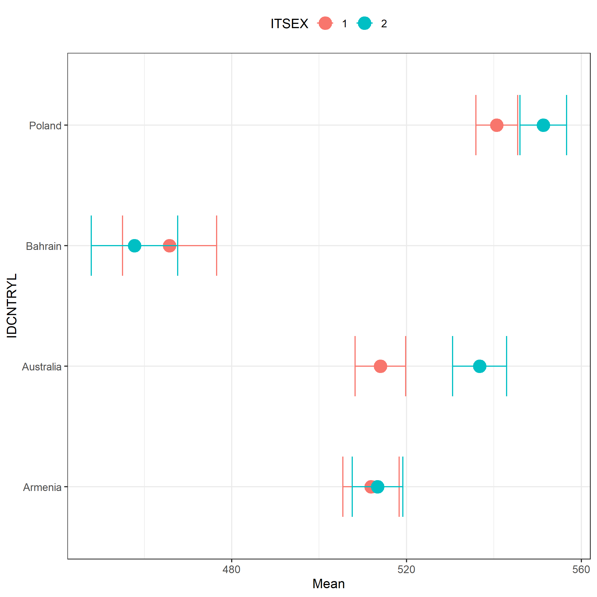

## Introduction

The `intsvy` R package was developed for data analysts, scientists, and students working on international educational studies such as: PISA, PIAAC, TIMSS, PIRLS and ICILS. `intsvy` simplifies the analysis of large datasets by automatically taking into account the methodology of studies conducted by OECD and IEA, such as weights, replication weights and plausible values (PVs). Using `intsvy`, you can easily calculate frequencies and estimate statistics such as mean, percentiles, and regression coefficients. It also comes with functionalities for visualizing results, using dedicated `plot()` functions.

::: {.callout-note}

## Additional resources

- [Full documentation](https://github.com/eldafani/intsvy)
- [CRAN documentation](https://cran.r-project.org/package=intsvy)
- [Video tutorials](https://ibe.edu.pl/pl/miedzynarodowe-badania-edukacyjne-zasoby/filmy-instruktazowe)
- [Use examples](https://www.daniel-caro.com/intsvy)
:::

### Why should you consider intsvy?

- **Automation**: simplifies data processing, by eliminating the necessity of dealing with weights and replications
- **Accessibility**: easily accessible functions for analysis and plotting
- **Flexibility**: supports data from multiple international studies

### Package limitations

::: {.callout-warning}

## Important limitations

`intsvy` does not support all international educational studies (e.g., SSES). Moreover, it does not support hierarchical modelling or advanced correlation analysis. If you want to perform such analyses you should consider using other packages, such as: 

- `lme4` for hierarchical linear models
- `psych` for correlation analysis
- `EdSurvey` offers support for a broad range of international educational studies

Some functions from `intsvy` such as `select.merge` work only with `.sav` files (SPSS data file).
:::

### Supported studies

| Study  (Organization)     |  Supported  |
|---------------------------|-------------|
| TIMSS (IEA)               | ✔           |
| PIRLS (IEA)               | ✔           |
| ICILS (IEA)               | ✔           |
| ICCS (IEA)                | ✘           |
| PIAAC (OECD)              | ✔           |
| PISA (OECD)               | ✔           |
| TALIS (OECD)              | ✘           |
| SSES (OECD)               | ✘           |


## Package installation

As with other R packages, you can install and load `intsvy` using following commands:

```{r}
#| eval: false
install.packages("intsvy")
library(intsvy)
```

You can also install the `haven` package in case you will need another way to work with `.sav` files (SPSS):

```{r}
#| eval: false
install.packages("haven")
library(haven)
```

## Downloading data

Data and documentation (e.g., codebooks with dataset and variable names) are available on the websites of the respective international studies:

- **PISA**: [www.oecd.org/pisa/data](https://www.oecd.org/pisa/data)
- **TIMSS**: [www.iea.nl/data-tools/repository/timss](https://www.iea.nl/data-tools/repository/timss)
- **PIRLS**: [www.iea.nl/data-tools/repository/pirls](https://www.iea.nl/data-tools/repository/pirls)
- **ICILS**: [www.iea.nl/data-tools/repository/icils](https://www.iea.nl/data-tools/repository/icils)
- **PIAAC**: [www.oecd.org/skills/piaac/data](https://www.oecd.org/skills/piaac/data)

::: {.callout-tip}
To use all functionalities of `intsvy`, you should download data in `.sav` format (SPSS) using the links above.
:::

### Data structure

Before starting the analysis, data from international studies must be imported into the R environment, which requires understanding their complex file structure.

#### IEA data structure

IEA datasets (TIMSS, PIRLS, ICILS) are typically divided into many files grouped by country, grade level, and type of survey tool used for the measurement. After downloading the TIMSS 2023 data for grade 4, you will see over 500 files in the folder.

::: {.callout-note}

## IEA file naming example

**Example:** File `asapolm8.sav` contains data for Polish students from TIMSS 2023 for grade 4 in `.sav` format.

Where:<br>
- `asa`: survey answers and tasks results of 4th graders<br>
- `pol`: country code (Poland)<br>
- `m8`: study cycle (TIMSS 2023)<br>

**First letter in the file name indicates the grade level:**<br>
- `a` – 4th grade<br>
- `b` – 8th grade<br>

**Next letters refer to the data type:**<br>
- `asa/bsa` – students' results and plausible values (PVs)<br>
- `asp/bsp` – process data (e.g., reaction times)<br>
- `ash` – parent questionnaire data<br>
- `asg/bsg` – student questionnaire data<br>
- `acg/bcg` – school questionnaire data<br>
- `atg/btg` – teacher questionnaire data
:::


#### PISA data structure
PISA study data is structured differently than those from IEA studies. Each country has its own file, and the data is divided into several files based on the type of survey tool (student, school, teacher) and the cycle of the study.

::: {.callout-note}

## Examples of PISA file naming
**Example**: File `CY08MSP_STU_QQQ.sav` contains data from student questionnaires from all countries in the study conducted in 2022.

Where:<br>
- `CY08` – study cycle (here: 2022)<br>
- `MSP` – Main Study <br>
- `STU_QQQ` – students' data <br>

**Other identifiers:**<br>
- `SCH_QQQ` – school questionnaire<br>
- `TCH_QQQ` – teacher questionnaire<br>
- `STU_COG` – students' results in cognitive tests (reading, math, science etc.)<br>
- `STU_FLT` – results of financial education tests<br>
- `STU_ICT` – results of information and communication technology tests<br>
- `STU_WBQ` – questionnaire on students' well-being<br>
:::

### Loading and merging data

`intsvy` allows for the quick loading and merging of data from various countries and sources using the `*.select.merge()` function, where `*` is the prefix of the study (`timss4g`, `timssg8`, `pisa`, `pirls` or `intsvy` for ICILS).

::: {.callout-important}
This function is designed to work with `.sav` files (SPSS format). The package requires specifying the folder containing the data and defining the variables to be merged. Replication weights and final weights, as well as plausible values (PVs), are added automatically. For IEA studies, the variable `IDCNTRYL` with the full country name is also created.
:::

#### Data from IEA studies

```{r}
#| eval: false
timss23 <- timssg4.select.merge(
  folder = "C:/ILSA/TIMSS/T23_Data_SPSS_G4/SPSS Data",
  countries = c("AUS", "BHR", "ARM", "POL"),
  student = c("ITSEX", "ASDAGE", "ASBGSLM"),
  home = c("ASBH01A", "ASBH01K"),
  school = c("ACBGDAS")
)
```
In the example above, we are merging data from TIMSS 2023. Make sure that the path to the folder with the data (`folder` argument) leads to the location where the data downloaded from the IEA website has been saved. Remember that in R, backslashes `\` (used in Windows) should be replaced with forward slashes `/`.

Arguments `countries`, `student`, `home`, and `school` allow you to select specific countries and variables according to the type of survey tool. In the example, Australia, Bahrain, Armenia, and Poland were selected, along with variables from the student, parent, and school questionnaires. The
`timss23` object contains selected data from the TIMSS 2023 study specified in the `student`, `home`, and `school` arguments, as well as default variables such as plausible values.

::: {.callout-tip}
`*var.label()` function can be used before importing data to review source files and decide which countries and variables to select.
:::

```{r}
#| eval: false
timssg4.var.label(folder = "C:/ILSA/TIMSS/T23_Data_SPSS_G4/SPSS Data")
```

#### Data from OECD studies

Loading data from a PISA study is similar, but requires specifying the names of the files containing the data.

```{r}
#| eval: false
pisa22 <- pisa.select.merge(
  folder = "C:/ILSA/PISA",
  school.file = "CY08MSP_SCH_QQQ.SAV",
  student.file = "CY08MSP_STU_QQQ.SAV",
  student = c("ST250Q02JA", "ESCS", "ST004D01T"),
  school = c("SC001Q01TA"),
  countries = c("Australia", "Canada", "Peru", "Poland")
)
```

::: {.callout-note}
Data from the PIAAC study are stored in separate files for each country (e.g., `PRGPOLPUF.sav` for Poland) and require merging for international analyses. This can be done using any function in R, such as `rbind`.
:::

## Functions in intsvy

Functions for data analysis have a prefix `*.function()`, where `*` corresponds to the study (`pisa`, `timss`, `pirls`, `piaac`, and `intsvy` for ICILS).

### Functions for analysis:

| Function | Description |
|----------|-------------|
| `*.mean.pv()` | Estimates mean(s) for variables with plausible values (PVs), takes weights into account |
| `*.mean()` | Estimates mean(s) for variables without plausible values (PVs), e.g., questionnaire data |
| `*.table()` | Creates frequency tables for categorical variables |
| `*.reg.pv()` | Runs linear regression with PVs |
| `*.reg()` | Runs linear regression without PVs |
| `*.log.pv()` | Runs logistic regression with PVs |
| `*.log()` | Runs logistic regression without PVs |
| `*.per.pv()` | Estimates percentiles for variables with PVs |
| `*.ben.pv()` | Calculates percentage of students who exceeded a given cut-off (also known as benchmarks) |

::: {.callout-note}
Functions return objects of classes (`intsvy.mean`, `intsvy.reg`, `intsvy.table`) that work with the `intsvy` `plot()` function.
:::

## Analyses examples

Below are examples of analyses conducted with previously created datasets from TIMSS (`timss23`) and PISA (`pisa22`).

### Means

```{r}
#| eval: false
# Mean scores in mathematics by country and gender in TIMSS
timss.mean.pv(
  pvlabel = paste0("ASMMAT0", 1:5), 
  by = c("IDCNTRYL", "ITSEX"), 
  data = timss23
)

# Mean scores in mathematics by country and gender in PISA
pisa.mean.pv(
  pvlabel = paste0("PV", 1:10, "MATH"), 
  by = c("CNT", "ST004D01T"), 
  data = pisa22
)
```

### Frequency tables

```{r}
#| eval: false
# Frequency tables of students' gender (TIMSS)
timss.table(variable = "ITSEX", by = "IDCNTRYL", data = timss23)

# Frequency tables of students' gender (PISA)
pisa.table(variable = "ST004D01T", by = "CNT", data = pisa22)
```

### Linear regression

```{r}
#| eval: false
# The effect of student's gender and early activities relating to counting (ASBH01K) 
# on mathematics scores in TIMSS
timss.reg.pv(
  pvlabel = paste0("ASMMAT0", 1:5), 
  by = "IDCNTRYL", 
  x = c("ITSEX", "ASBH01K"), 
  data = timss23
)

# The effect of socioeconomic status (ESCS) on mathematics scores in PISA
pisa.reg.pv(
  pvlabel = paste0("PV", 1:10, "MATH"), 
  by = "CNT", 
  x = c("ESCS"), 
  data = pisa22
)
```

### Logistic regression

```{r}
#| eval: false
# Probability of achieving ≥550 points in mathematics in TIMSS based on
# gender and attitude towards mathematics (ASBGSLM)
timss.log.pv(
  pvlabel = paste0("ASMMAT0", 1:5), 
  cutoff = 550, 
  x = c("ITSEX", "ASBGSLM"), 
  by = "IDCNTRYL", 
  data = timss23
)

# Probability of having a computer at home depending on socioeconomic status (ESCS) in PISA
pisa.log(y = "ST250Q02JA", x = "ESCS", by = "CNT", data = pisa22)
```

### Percentiles

```{r}
#| eval: false
# Percentiles of mathematics achievement in TIMSS (e.g., 5, 25, 50, 75, 95)
timss.per.pv(
  pvlabel = paste0("ASMMAT0", 1:5), 
  per = c(5, 25, 50, 75, 95), 
  by = "IDCNTRYL", 
  data = timss23
)

# Percentiles of mathematics achievement in PISA (e.g., 10, 25, 75, 90)
pisa.per.pv(
  pvlabel = paste0("PV", 1:10, "MATH"), 
  per = c(10, 25, 75, 90), 
  by = "CNT", 
  data = pisa22
)
```

### Calculating the percentage of students at each skill level
```{r}
#| eval: false
# The percentage of students in TIMSS achieving scores equal to or above 
# the benchmarks: 400, 475, 550, 625 points
timss.ben.pv(
  pvlabel = paste0("ASMMAT0", 1:5), 
  by = "IDCNTRYL", 
  cutoff = c(400, 475, 550, 625), 
  data = timss23
)

# The percentage of students in PISA achieving scores equal to or above
# the benchmarks: levels 1–6 (355–698 points)
pisa.ben.pv(
  pvlabel = paste0("PV", 1:10, "MATH"), 
  by = "CNT", 
  cutoff = c(355, 407, 480, 553, 626, 698), 
  data = pisa22
)
```

## Graphical presentation of results

The results of analyses conducted using `intsvy` package functions (means, regressions, frequency distributions) can be visualized using dedicated `plot()` functions.

::: {.callout-tip}
## Additional export functionalities

The results of the analyses can be:
- printed to console using the `summary()` function from `base` R,
- exported to a `.csv` file, using `export = TRUE` argument of analytical functions (means, regressions, frequencies).

`na.omit()` can be used to remove missing data from the analysis results before visualization, preventing errors in generating plots.
:::

### Plotting means

```{r}
#| eval: false
# A scatter plot with confidence intervals showing mean scores in mathematics
# by country and gender (TIMSS)
plot.intsvy.mean(
  na.omit(
    timss.mean.pv(
      pvlabel = paste0("ASMMAT0", 1:5), 
      by = c("IDCNTRYL", "ITSEX"), 
      data = timss23
    )
  )
)


```

{fig-align="center"}

### Plotting regression results

```{r}
#| eval: false
# A plot of the relationship between socioeconomic status (ESCS)
# and student achievement in mathematics by country (PISA)
plot.intsvy.reg(
  na.omit(
    pisa.reg.pv(
      pvlabel = paste0("PV", 1:10, "MATH"), 
      x = "ESCS", 
      by = "CNT", 
      data = pisa22
    )
  )
)
```

{fig-align="center"}

### Plotting frequencies

```{r}
#| eval: false
# A stacked bar plot showing the distribution of students' gender
# in each country (TIMSS)
plot.intsvy.table(
  na.omit(
    timss.table(
      variable = "ITSEX", 
      by = "IDCNTRYL", 
      data = timss23
    )
  ), 
  stacked = TRUE
)
```

{fig-align="center"}

## Summary

The `intsvy` package automatically handles analyses of educational data containing plausible values (PVs) and replication weights, automatically selecting the weighting scheme and supporting the specific nature of data from international educational studies.

::: {.callout-important}
## Take home messages

1. **Documentation**: It is crucial to familiarize yourself with the documentation of the specific study to correctly determine the data structure, variable names, and to use appropriate functions from the `intsvy` package
2. **Verification**: It is recommended to verify the results of analyses with official international or national reports to confirm their correctness
:::