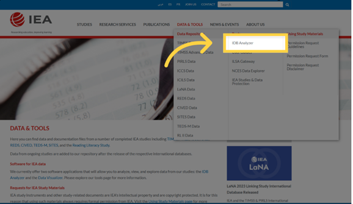
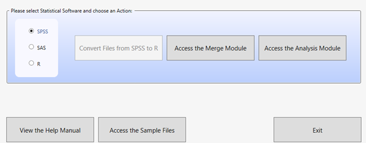
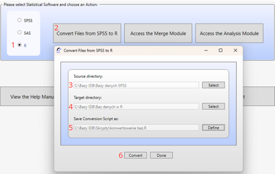
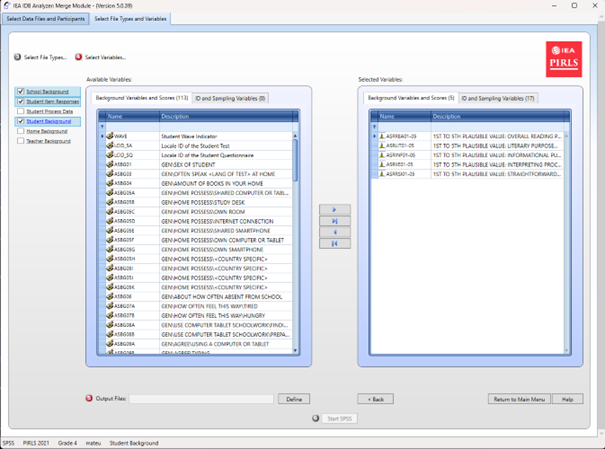
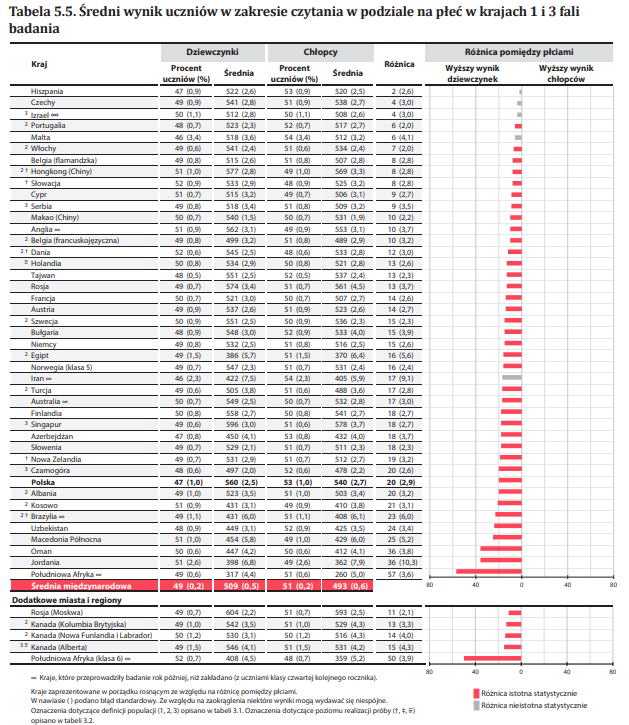

## Czym jest IDB Analyzer?

IDB Analyzer to bezpłatne narzędzie opracowane przez Międzynarodowe Stowarzyszenie Mierzenia Osiągnięć Szkolnych, IEA, służące do pracy z danymi z międzynarodowych badań edukacyjnych organizowanych przez IEA i OECD (Organizację Współpracy Gospodarczej i Rozwoju). Oferuje intuicyjny interfejs, który ułatwia pracę z danymi bez konieczności zaawansowanej znajomości programowania.

**Główne funkcjonalności narzędzia obejmują:**

- **Generowanie kodu analitycznego**: Automatycznie tworzy skrypty w językach SPSS, SAS lub R, uwzględniające metodologię badań IEA i OECD, w tym wagi statystyczne, losowy dobór próby oraz wartości prawdopodobne (<i>plausible values</i>, PVs)
- **Integracja danych**: Umożliwia łączenie różnych typów plików danych (np. dotyczących uczniów, nauczycieli, szkół czy rodziców) z wielu krajów w jeden spójny zbiór danych
- **Przygotowanie danych do analizy**: Pozwala na wybór określonych zmiennych i tworzenie dostosowanych zestawów danych, gotowych do dalszego przetwarzania statystycznego
- **Analizy statystyczne**: Umożliwia obliczanie statystyk takich jak: średnie, procenty, percentyle, korelacje, współczynniki regresji oraz odsetki uczniów osiągających określone poziomy umiejętności (benchmarki)
- **Konwersja formatów danych**: Umożliwia przekształcanie baz danych z formatu `.sav` (SPSS) do formatu `.RData` (R), co ułatwia pracę w środowisku R

::: {.callout-important}
## Ważne informacje o działaniu programu

IEA IDB Analyzer nie wykonuje analiz samodzielnie – generuje gotowy kod, który należy uruchomić w wybranym środowisku statystycznym (SPSS, SAS lub R). Wersja 5.0 IEA IDB Analyzer wymaga oprogramowania R (w wersji 4.2.0 lub nowszej), SPSS lub SAS.
:::

::: {.callout-tip}
## Dodatkowe zasoby

- Narzędzie jest dostępne do pobrania ze strony [IEA Data and Tools](https://www.iea.nl/data-tools/tools)
- Szczegółowa dokumentacja, w tym instrukcja obsługi, znajduje się w interfejsie aplikacji pod przyciskiem „Help"
- Na stronie [Instytutu Badań Edukacyjnych - Państwowego Instytutu Badawczego ](https://ibe.edu.pl/pl/miedzynarodowe-badania-edukacyjne-zasoby/filmy-instruktazowe) dostępne są filmy instruktażowe pokaujące jak wykorzystać pakiet IEA IDB Analyzer do analizy danych z badań międzynarodowych.
:::
```{=latex}
\newpage
```
### Obsługiwane badania

IEA IDB Analyzer obsługuje dane z szeregu międzynarodowych badań edukacyjnych realizowanych przez IEA, OECD, UNESCO oraz inne organizacje. W zależności od projektu możliwe jest zarówno łączenie plików danych (merge), jak i prowadzenie analiz statystycznych (analysis). Obsługiwane są trzy środowiska: SPSS, SAS oraz R.

| Badanie / Organizacja | Typ obsługi | SPSS | SAS | R |
|----------------------|-------------|------|-----|---|
| TIMSS / PIRLS / ICILS / ICCS (IEA) | Łączenie baz i analiza | ✔ | ✔ | ✔ |
| TALIS / PIAAC / PISA (OECD) | Analiza | ✔ | ✔ | ✔ |

### Pobieranie danych

Dane i dokumentacja (np. opisy nazw zbiorów i zmiennych) z badań dostępne są na poniższych stronach:

- **PISA**: [www.oecd.org/pisa/data](https://www.oecd.org/pisa/data)
- **TIMSS, PIRLS, ICCS, ICILS**: [www.iea.nl/data-tools/repository](https://www.iea.nl/data-tools/repository)
- **PIAAC**: [www.oecd.org/skills/piaac/data](https://www.oecd.org/skills/piaac/data)
- **TALIS**: [www.oecd.org/en/about/programmes/talis](https://www.oecd.org/en/about/programmes/talis.html#data)

### Wymagania systemowe, instalacja i uruchamianie programu

::: {.callout-note}
## Wymagania systemowe

Korzystanie z programu wymaga:

- **Systemu operacyjnego**: Windows 10 lub 11
  - Użytkownicy macOS mogą korzystać z programu wyłącznie przez maszynę wirtualną z zainstalowanym systemem Windows (np. Parallels Desktop lub VirtualBox)
- **Zainstalowanego wybranego środowiska analitycznego**:
  - IBM SPSS Statistics
  - SAS
  - lub R (w wersji 4.2.0 lub nowszej) wraz z RStudio
- **Dostępu do baz danych**: pobrane na dysk w formacie `.sav`, `.sas7bdat` lub `.RData` z Repozytorium Danych <br>i Narzędzi IEA lub strony OECD
:::

#### Instalacja programu

1. Pobierz najnowszą wersję instalatora ze strony: https://www.iea.nl/data-tools/tools

{fig-align="center"}

2. Zapisz plik instalacyjny w dowolnym folderze i uruchom instalator jako administrator
3. Przejdź przez proces instalacji, pozostawiając domyślne ustawienia
4. Po zakończeniu instalacji uruchom program: Menu Start → IEA → IEA IDB Analyzer

#### Uruchamianie aplikacji i dostępne moduły

Po uruchomieniu programu wyświetli się ekran główny z wyborem środowiska statystycznego: SPSS, SAS lub R.

{fig-align="center"}

W zależności od wybranego środowiska dostępne są trzy moduły:

- **Convert Module** (moduł konwersji) - dostępny po zaznaczeniu środowiska R, umożliwia konwersję plików `.sav` do formatu `.RData`
- **Merge Module** (moduł łączenia) - służy do łączenia danych z różnych plików odpowiadających zazwyczaj różnym narzędziom/bazom danych z danego badania (np. uczniowie, nauczyciele, szkoły) lub baz z kilku krajów w ramach danego badania
- **Analysis Module** (moduł analizy) - pozwala na przygotowanie skryptów do analizy danych (w SPSS, SAS lub R)

::: {.callout-tip}
## Zalecana kolejność pracy

Zwykle pracę rozpoczyna się od **Merge Module**, a następnie przechodzi do **Analysis Module**. W przypadku pracy w R, może być konieczne wcześniejsze użycie **Convert Module** w celu przekonwertowania plików danych na format obsługiwany przez RStudio.
:::

Dodatkowo na ekranie startowym dostępne są przyciski:

- **View the Help Manual** - otwiera instrukcję obsługi
- **Access the Sample Files** - umożliwia pobranie przykładowych danych
- **Exit** - zamyka program

## Moduły programu

Program IEA IDB Analyzer składa się z trzech modułów, które wspólnie umożliwiają pełny cykl przygotowania i analizy danych z międzynarodowych badań edukacyjnych: od konwersji plików, przez ich łączenie, aż po generowanie kodu analitycznego.

### Moduł konwersji (Convert Module)

Convert Module służy do konwersji plików danych w formacie `.sav` (SPSS) do formatu `.RData`, który jest wymagany do dalszej analizy w środowisku R. Jest to pierwszy krok, jeśli planujesz przeprowadzać analizy w R a bazy danych, które posiadasz są w formacie `.sav`.

**Funkcje modułu:**

- Automatyczne wykrywanie wszystkich plików `.sav` we wskazanym folderze źródłowym
- Generowanie skryptu do konwersji danych SPSS do R
- Konwersja zmiennych z zachowaniem etykiet nazw i wartości
- Zapisanie plików wynikowych w folderze docelowym oraz otwarcie gotowego skryptu <br>w RStudio lub innym edytorze

::: {.callout-warning}
## Wymagania i zalecenia

- Wszystkie zmienne muszą mieć przypisane etykiety (label), w przeciwnym razie mogą wystąpić błędy
- Zalecane jest trzymanie plików źródłowych i wynikowych w osobnych folderach
- Konieczne jest zainstalowanie R oraz RStudio
:::

**Kroki użytkowania:**

{fig-align="center"}

1. Uruchom program i wybierz środowisko „R"
2. Kliknij przycisk „Convert Files from SPSS to R"
3. Wskaż folder źródłowy z plikami `.sav`
4. Wskaż folder docelowy, gdzie mają trafić pliki `.RData`
5. Zdefiniuj nazwę skryptu konwersji
6. Naciśnij „Convert" i uruchom wygenerowany skrypt w RStudio

### Moduł łączenia (Merge Module)

Merge Module służy do łączenia danych z wielu krajów oraz różnych poziomów i źródeł (np. uczniowie, nauczyciele, szkoły), dzięki czemu powstaje jeden spójny zbiór gotowy do analizy. Program automatycznie generuje kod w wybranym języku (SPSS, SAS lub R), który umożliwia utworzenie zintegrowanego pliku danych zgodnie z konfiguracją użytkownika.

**Główne funkcje modułu:**

- Łączenie danych z wielu krajów biorących udział w badaniu
- Integracja plików pochodzących od różnych typów respondentów (np. uczniowie, szkoły, nauczyciele)
- Wybór zmiennych do analizy - możliwość ograniczenia liczby zmiennych w tworzonym zbiorze
- Edycja listy krajów (zmiana etykiet, dodanie lub usunięcie pozycji)

::: {.callout-warning}
## Ograniczenia i uwagi

- Moduł obsługuje tylko jedną edycję badania jednocześnie (np. PIRLS 2016). Aby połączyć dane z różnych cykli (np. PIRLS 2011 i 2016), należy wcześniej przygotować zbiory poza programem (często instrukcje, jak to zrobić, są w raportach technicznych danych badań)
- W środowisku R Merge Module wykorzystuje funkcję `left_join()` z pakietu `dplyr`. Aby zachować zgodność, zaleca się użycie tej samej metody przy łączeniu danych poza programem
- Program rozpoznaje pliki na podstawie ich nazw, zgodnych z ustalonymi wzorcami. Dlatego nie należy zapisywać pliku wynikowego w tym samym folderze, co pliki źródłowe - może to prowadzić do błędów
- Pliki muszą zawierać etykiety zmiennych i wartości (szczególnie istotne w środowisku R), a sama struktura plików musi być spójna między krajami
:::

**Kroki użytkowania:**

1. **Uruchom program** i wybierz środowisko statystyczne (SPSS, SAS lub R). Przejdź do zakładki Merge Module

2. **Wybierz folder z danymi**: Wskaż folder zawierający pobrane wcześniej pliki danych z wybranego badania. Wszystkie pliki muszą znajdować się w tym samym folderze. Program automatycznie rozpozna badanie, cykl i populację, wyświetlając listę dostępnych krajów

3. **Wybierz kraje do analizy**: Z listy Available Participants wybierz kraje, klikając je i przenosząc do panelu Selected Participants za pomocą strzałki (→) lub podwójnego kliknięcia. Aby wybrać wiele krajów, przytrzymaj klawisz Ctrl. Użyj strzałki (→|) do zaznaczenia wszystkich krajów

{fig-align="center"}

4. **(Opcjonalnie)** Kliknij Edit Country List, aby edytować etykiety krajów poprzez dodanie lub usunięcie pozycji (każda musi zawierać 3-literowy kod, kod ISO i pełną nazwę)


5. **Wybierz typy plików danych**: Kliknij Next, aby przejść do zakładki Select File Types and Variables. Zaznacz pola obok typów danych, które chcesz uwzględnić, np. School Context, Student Achievement, Student Context, Student Home, Teacher Context


::: {.callout-important}
Aby połączyć dane różnych typów, np. uczniów z danymi rodziców, szkół lub nauczycieli, wybierz odpowiednie typy plików. Upewnij się, że dane są łączone zgodnie z metodologią badania, ponieważ niektóre typy danych (np. nauczycielskie) wymagają analizy w odniesieniu do uczniów. Sprawdź dokumentację techniczną badania (np. w <br>instrukcji Help), aby ustalić, jak poprawnie łączyć dane i interpretować wyniki.
:::

6. **Wybierz zmienne**: Z listy Available Variables wybierz zmienne do analizy, przenosząc je do panelu Selected Variables za pomocą strzałki (→). Użyj strzałki (→|) do zaznaczenia wszystkich zmiennych. Część zmiennych (identyfikacyjne i analityczne) przenosi się automatycznie. Zmienne identyfikacyjne<br> i samplingowe są domyślnie wybrane

{fig-align="center"}

7. **Określ lokalizację zapisu**: W polu Output Files kliknij Define, aby wskazać folder i nazwę dla pliku wynikowego oraz skryptu (np. `*.R`, `*.SPS`, `*.SAS`). Nazwa pliku nie może zawierać znaków specjalnych

8. **Wygeneruj i uruchom skrypt**: Kliknij Start SPSS/SAS/R, aby utworzyć skrypt. Uruchom go w wybranym środowisku statystycznym (w R kliknij Source lub naciśnij Ctrl + Shift + Enter; w SPSS wybierz Run > All; w SAS kliknij Run lub Submit)

### Moduł analizy (Analysis Module)

Analysis Module to kluczowy komponent programu IEA IDB Analyzer, który umożliwia generowanie gotowych skryptów analitycznych w środowiskach SPSS, SAS lub R. Moduł został zaprojektowany do analizy danych z międzynarodowych badań edukacyjnych, uwzględniając ich złożony schemat doboru próby, w tym wagi próbkowania, wagi replikacyjne oraz wartości prawdopodobne (<i>plausible values</i>, PV).

::: {.callout-note}
## Metodologia analizy

Program automatycznie wykorzystuje metodę Jackknife Repeated Replication (JRR) lub Balanced Repeated Replication (BRR), dzięki czemu poprawnie oblicza odchylenia standardowe analizowanych statystyk, w pełni uwzględniając strukturę losowania próby.

Użytkownik może wybrać typ analizy, zmienne, a także określić, czy uwzględniać braki danych w zmiennych grupujących (domyślnie są one wykluczane, ale można je uwzględnić jako kategorie raportowania). W zależności od badania i wybranej analizy program sam dobiera odpowiednie metody. Wyniki są generowane w formie składni, którą należy uruchomić w wybranym oprogramowaniu statystycznym.
:::

Poniżej przedstawiono dostępne typy analiz wraz z ich obsługą w różnych środowiskach:

| Typ analizy | SPSS | SAS | R |
|-------------|------|-----|---|
| Rozkłady częstości (Percentages only) | ✔ | ✔ | ✔ |
| Rozkłady częstości i średnie (z t-testami) (Percentages and Means) | ✔ | ✔ | ✔ |
| Rozkłady umiejętności (Benchmarks) | ✔ | ✔ | ✔ |
| Percentyle (Percentiles) | ✔ | ✔ | ✔ |
| Korelacje (Correlations Pearson/Spearman) | ✔ | ✔ | ✔ |
| Regresja liniowa (Linear Regression) | ✔ | ✔ | ✔ |
| Regresja logistyczna (dychotomiczna) (Logistic Regression) | ✔ | ✔ | ✘ |

#### Procentowe rozkłady częstości (Percentages only)

Ten typ analizy służy do obliczania procentowych rozkładów zmiennych kategorycznych z uwzględnieniem błędów standardowych. Analiza może być przeprowadzona z uwzględnieniem jednej lub więcej zmiennych grupujących, takich jak np. płeć czy kraj. Domyślnie jako pierwsza zmienna grupująca stosowana jest IDCNTRY, co umożliwia porównanie wyników między krajami. Opcja Separate Tables by generuje osobne tabele dla każdej zmiennej analizowanej, ułatwiając porównania.

::: {.callout-note}
## Przykład zastosowania

Możliwe jest określenie odsetka chłopców i dziewcząt wśród uczniów klasy czwartej w każdym z krajów uczestniczących w badaniu PIRLS.
:::

#### Procentowe rozkłady i średnie (Percentages & Means)

Moduł oblicza procentowe rozkłady oraz średnie dla zmiennych ciągłych lub kategorycznych, wraz z odchyleniami standardowymi i błędami standardowymi. Generuje także statystyki t-testów do porównania średnich i procentów między grupami. Użytkownik wybiera zmienne grupujące (np. IDCNTRY, płeć) oraz zmienne analizowane (np. wyniki testów). Aby uwzględnić wyniki osiągnięć, w menu Plausible Value Option wybierz opcję Use PVs i określ zestaw wartości prawdopodobnych.

::: {.callout-note}
## Przykład zastosowania

Można porównać średnie wyniki z matematyki między chłopcami a dziewczętami w różnych krajach i sprawdzić istotność statystyczną różnic.
:::

#### Poziomy umiejętności (Benchmarks)

Moduł Benchmarks oblicza odsetek respondentów osiągających określone poziomy biegłości (np. międzynarodowe benchmarki) lub punkty odcięcia zdefiniowane przez użytkownika. Analiza może być przeprowadzona w dwóch trybach:

- **Kumulatywny**: Odsetek respondentów na lub powyżej danego progu
- **Dyskretny**: Odsetek respondentów w określonych przedziałach, z możliwością obliczania średnich dla wybranych zmiennych w każdej grupie

Użytkownik wybiera w menu Plausible Value Option wartości prawdopodobne (PVs) i określa punkty odcięcia w polu Achievement Benchmarks. Analiza uwzględnia zmienne grupujące (np. kraj, płeć) i umożliwia porównanie różnic procentowych oraz średnich między grupami.

::: {.callout-note}
## Przykład zastosowania

Można zbadać, jaki procent uczniów w każdym kraju osiągnął określony poziom biegłości w czytaniu według skali PIRLS.
:::

#### Percentyle (Percentiles)

Moduł Percentiles oblicza wartości punktowe (np. 25., 50., 75. percentyl), które dzielą rozkład zmiennych ciągłych (np. wyniki testów) na określone części. Analiza jest przeprowadzana w podgrupach zdefiniowanych przez zmienne grupujące (np. IDCNTRY, płeć). Użytkownik wpisuje percentyle (oddzielone spacją) w polu Percentiles.

::: {.callout-note}
## Przykład zastosowania

Można sprawdzić, jaki wynik z matematyki należało uzyskać, aby znaleźć się wśród 10% najlepszych uczniów (jaki wynik odpowiada 90. percentylowi w danym kraju).
:::

#### Korelacje (Correlations)

Moduł korelacji umożliwia obliczanie współczynników korelacji Pearsona dla zmiennych ilościowych oraz korelacji rang Spearmana dla zmiennych porządkowych. Analiza może być przeprowadzona w podgrupach, np. w obrębie krajów. Umożliwia analizę związku między takimi zmiennymi, jak nastawienie do czytania a częstotliwość czytania. Możliwe jest również obliczanie korelacji między wynikami testu a dowolną skalą zawartą w badaniu.

::: {.callout-note}
## Przykład zastosowania

Możliwe jest zbadanie, czy istnieje związek między czasem poświęcanym na naukę<br> a wynikami.
:::

#### Regresja liniowa (Linear Regression)

Moduł regresji liniowej umożliwia budowę modeli statystycznych przewidujących wartość zmiennej zależnej na podstawie jednego lub wielu predyktorów. Analiza może uwzględniać zmienne ciągłe (np. liczba godzin nauki), i kategoryczne (np. płeć czy typ szkoły), które program automatycznie koduje (np. metodą dummy coding lub effect coding w menu Contrast). Moduł umożliwia także uwzględnienie wartości prawdopodobnych (<i>Plausible values</i>, PVs) jako zmiennych zależnych lub niezależnych.

::: {.callout-note}
## Przykład zastosowania

Użytkownik może zbudować model pokazujący wpływ płci, statusu społeczno-ekonomicznego oraz liczby godzin nauki na wyniki z matematyki. Wyniki przedstawiają szacowaną zmianę wartości zmiennej zależnej przy zmianie każdego z predyktorów, przy założeniu niezmienności pozostałych czynników.
:::

#### Regresja logistyczna (Logistic Regression)

Moduł Logistic Regression umożliwia modelowanie prawdopodobieństwa wystąpienia zdarzenia binarnego (np. tak/nie) na podstawie zmiennych niezależnych (ciągłych lub kategorycznych). Generuje on składnię do analizy w programach SPSS lub SAS (moduł ten nie jest dostępny dla R). Model może uwzględniać zmienne niezależne o charakterze ciągłym (np. SES) lub kategorycznym (np. płeć).

::: {.callout-note}
## Dodatkowe funkcje w SAS

W przypadku programu SAS dostępna jest również opcja regresji wielomianowej, umożliwiająca analizę zmiennych zależnych posiadających więcej niż dwie kategorie.
:::

Wyniki analizy obejmują współczynniki regresji, błędy standardowe oraz ilorazy szans (<i>odds ratios</i>), które wskazują, w jaki sposób zmienne niezależne wpływają na prawdopodobieństwo wystąpienia zdarzenia.

::: {.callout-note}
## Przykład zastosowania

Można zbadać, jak płeć ucznia i status socjoekonomiczny (SES) wpływają na szansę osiągnięcia poziomu „zaawansowanego" w czytaniu (np. w badaniu PIRLS).
:::

## Przykładowa analiza z wykorzystaniem programu IDB Analyzer

Poniższy przykład opiera się na badaniu PIRLS 2021 i przedstawia analizę odpowiadającą na pytanie: **„Jaki jest średni wynik z czytania uczniów czwartej klasy  — chłopców i dziewczynek?"** Analiza zostanie przeprowadzona za pomocą programu IEA IDB Analyzer, z wykorzystaniem oficjalnych danych ze strony IEA.

::: {.callout-note}
## Kontekst analizy

Wyniki analizy odpowiadają danym przedstawionym w Tabeli 5.5 [krajowego raportu PIRLS 2021 (s. 65)](https://pirls.ibe.edu.pl/wp-content/uploads/2023/05/PIRLS_2021_Wyniki-miedzynarodowego-badania-osiagniec-czwartoklasistow-w-czytaniu.pdf) i zostaną zreplikowane w tym przykładzie.
:::

{fig-align="center"}

### Krok 1: Pobranie i przygotowanie danych

1. Pobierz dane z badania PIRLS 2021 ze strony [IEA Study Data Repository](https://www.iea.nl/data-tools/repository)

2. **Scal dane za pomocą Merge Module** w programie IEA IDB Analyzer:
   - Uruchom program i wybierz Merge Module
   - Wskaż odpowiednie pliki danych źródłowych (Student Background oraz Student Item Response) zgodnie z instrukcjami z rozdziału 2.2
   - Zaznacz kraje, które chcesz uwzględnić w analizie (w przykładzie wybrano Bułgarię, Danię, Irlandię oraz Polskę)
   - Wygeneruj i uruchom kod, który utworzy scalony plik danych

### Krok 2: Uruchomienie IDB Analyzer - moduł analityczny

{fig-align="center"}

1. Otwórz moduł **Analysis Module** w programie IEA IDB Analyzer

2. Wybierz scalony plik danych utworzony w Kroku 1 jako Analysis File, klikając przycisk Select

3. Wybierz **PIRLS (Using Student Weights)** jako typ analizy (Analysis Type)

4. Wybierz **Percentages & Means** jako Statistic Type

5. Wybierz opcję **Use PVs** w menu Plausible Value Option

::: {.callout-tip}
## Ustawienia formatowania

- Domyślna wartość w menu Number of Decimals wynosi 2. Zmiana tej wartości wpływa jedynie na liczbę widocznych miejsc dziesiętnych w plikach wyjściowych
- Domyślna wartość w menu Show Graphs to Yes. Wybranie opcji Yes spowoduje wygenerowanie wykresów <br>w pliku wyjściowym
:::

6. **Określ zmienną płeć (ITSEX)** jako drugą zmienną grupującą (pierwszą domyślnie jest IDCNTRY), klikając najpierw pole Grouping Variables, aby je aktywować. Następnie wybierz zmienną ITSEX z listy zmiennych w lewym panelu i przenieś ją do pola Grouping Variables, klikając strzałkę w prawo (→)

::: {.callout-important}
Program automatycznie zaznacza opcję **Exclude Missing From Analysis**, która wyklucza przypadki z brakującymi danymi w zmiennych grupujących. Ta opcja powinna być zaznaczona dla tej analizy.
:::

7. Pole **Separate Tables by** powinno pozostać puste (dotyczy analiz z wieloma zmiennymi grupującymi lub zmiennymi zależnymi innymi niż wynik osiągnięć)

8. **Określ wyniki testów do analizy**, klikając najpierw pole Plausible Values, aby je aktywować. Następnie wybierz zestaw wartości prawdopodobnych (ASRREA01-05) z listy dostępnych zmiennych <br>w lewym panelu i przenieś je do pola Plausible Values po prawej stronie, klikając strzałkę w prawo (→)

9. Zmienna wagowa jest wybierana automatycznie przez program; dla danych kontekstowych uczniów domyślnie wybierana jest TOTWGT

10. **Określ nazwę dla plików wynikowych** oraz folder, w którym będą przechowywane, klikając przycisk Define w polu Output Files. IEA IDB Analyzer utworzy również skrypt R (`.R`), składnię SPSS (`.SPS`) lub składnię SAS (`*.SAS`) o tej samej nazwie i w tym samym folderze, zawierające kod niezbędny do przeprowadzenia analizy

::: {.callout-note}
## Przykład nazewnictwa

Skrypt i pliki wyjściowe mogą być nazwane WynikiSex i zapisane w folderze `C:\PIRLS2021\Analizy`
:::

11. **Kliknij przycisk Start R** (lub Start SPSS/SAS), aby utworzyć skrypt R (lub składnię SPSS/SAS) i otworzyć go do wykonania. Program wyświetli ostrzeżenie, jeśli plik w określonym folderze ma zostać nadpisany

12. **Uruchom skrypt**: Skrypt R można wykonać, klikając przycisk Source lub naciskając Ctrl+Alt+R na klawiaturze. W SPSS otwórz menu Run i wybierz opcję All. W SAS kliknij przycisk Run (lub wybierz Submit w menu Run)

### Interpretacja wyników

::: {.callout-important}
## Pliki wynikowe

Program IEA IDB Analyzer generuje i zapisuje wyniki w folderze określonym w kroku 10. Dla statystyki Percentages & Means z dodatkową zmienną grupującą (np. płeć, obok IDCNTRY), generowane są dwa dodatkowe pliki wyników:

- plik z sufiksem **„_sig"**, który raportuje istotność różnic między grupami analitycznymi - w tym przypadku między dziewczętami a chłopcami - dla każdego kraju
- plik z sufiksem **„_sig2"**, który raportuje istotność różnic między krajami w obrębie każdej grupy płci
:::

Poniżej przedstawiono plik wynikowy “_sig” wygenerowany dla analizy wykonanej w R.

{fig-align="center"}

W wynikowej tabeli możemy przeczytać, że dziewczęta w Polsce osiągnęły średni wynik 559,75 (błąd standardowy: 2,48), natomiast chłopcy 539,69 (błąd standardowy: 2,71). Różnica wynosi więc 20,06 punktu.

{fig-align="center"}

**Istotność statystyczna różnic** różnic między płciami jest określana na podstawie pliku wyjściowego z sufiksem „_sig”. W kolumnie mnpvdiff raportowana jest różnica średnich wyników, a w kolumnie mnpvdiff_se - jej błąd standardowy. Iloraz tych wartości daje statystykę t (mnpvdiff_t). Dla poziomu istotności α = 0,05, wartości t poniżej -1,96 lub powyżej +1,96 wskazują na istotne różnice statystyczne. <br>W przypadku Polski wartość t wynosi -6,80, co oznacza, że różnica między płciami jest statystycznie istotna.