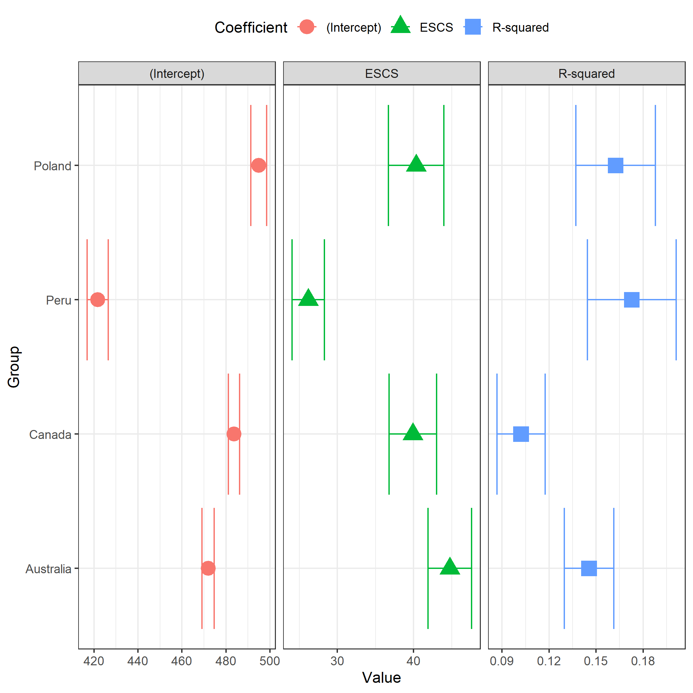
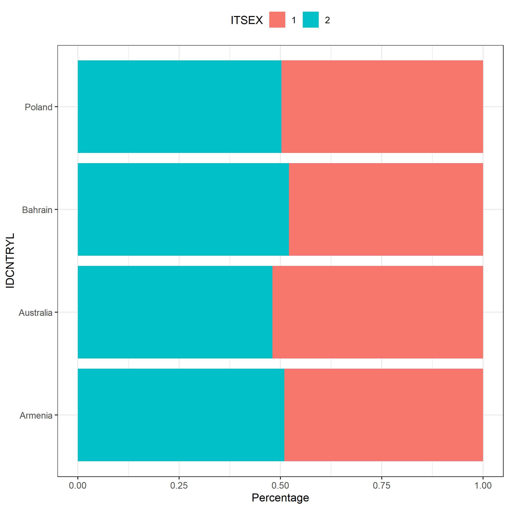

## Wprowadzenie

Pakiet `intsvy` w R to narzędzie stworzone m.in. dla analityków, naukowców i studentów zajmujących się międzynarodowymi badaniami edukacyjnymi: PISA, PIAAC, TIMSS, PIRLS oraz ICILS. Upraszcza ono analizę dużych zbiorów danych, automatycznie uwzględniając metodologię badań OECD i IEA, taką jak wagi statystyczne, wagi replikacyjne czy wartości prawdopodobne (<i>plausible values</i>, PVs). Dzięki `intsvy` można szybko obliczać statystyki, takie jak średnie, procenty, percentyle czy współczynniki regresji, oraz przedstawiać wyniki w formie graficznej.

::: {.callout-note}
## Dodatkowe zasoby

- [Pełna dokumentacja](https://github.com/eldafani/intsvy)
- [Dokumentacja CRAN](https://cran.r-project.org/package=intsvy)
- [Filmy instruktażowe](https://ibe.edu.pl/pl/miedzynarodowe-badania-edukacyjne-zasoby/filmy-instruktazowe)
- [Przykłady wykorzystania](https://www.daniel-caro.com/intsvy)
:::

### Dlaczego warto używać pakietu intsvy?

- **Automatyzacja**: upraszcza przetwarzanie złożonych danych, eliminując konieczność ręcznego uwzględniania wag i replikacji
- **Dostępność**: ma łatwo dostępne funkcje do analizy i wizualizacji danych
- **Elastyczność**: obsługuje dane z wielu badań edukacyjnych

### Ograniczenia pakietu

::: {.callout-warning}
## Ważne ograniczenia

Pakiet `intsvy` obsługuje tylko część międzynarodowych badań edukacyjnych. Ponadto nie wspiera modeli wielopoziomowych (np. HLM) ani zaawansowanej analizy korelacji. W celu wykonania takich analiz warto rozważyć użycie innych pakietów, takich jak:

- `lme4` do modeli wielopoziomowych
- `psych` do analizy korelacji
- `EdSurvey` oferuje wsparcie dla szerszego zakresu badań międzynarodowych

Niektóre funkcje pakietu `intsvy` jak np. `select.merge` działają tylko na plikach <br>o rozszerzeniu `.sav`
:::

### Obsługiwane badania

| Badanie  (Organizacja)     | Obsługiwane |
|---------------------------|-------------|
| TIMSS (IEA)               | ✔           |
| PIRLS (IEA)               | ✔           |
| ICILS (IEA)               | ✔           |
| ICCS (IEA)                | ✘           |
| PIAAC (OECD)              | ✔           |
| PISA (OECD)               | ✔           |
| TALIS (OECD)              | ✘           |
| SSES (OECD)               | ✘           |


## Instalacja pakietu intsvy

Jak w przypadku innych pakietów R, `intsvy` instaluje się i ładuje do środowiska R za pomocą komend:

```{r}
#| eval: false
install.packages("intsvy")
library(intsvy)
```

W razie potrzeby zainstaluj dodatkowe pakiety do wczytywania danych, np. `haven` dla obsługi plików `.sav` (SPSS):

```{r}
#| eval: false
install.packages("haven")
library(haven)
```

## Pobieranie danych

Dane i dokumentacja (np. opisy nazw zbiorów i zmiennych) z badań dostępne są na poniższych stronach:

- **PISA**: [www.oecd.org/pisa/data](https://www.oecd.org/pisa/data)
- **TIMSS**: [www.iea.nl/data-tools/repository/timss](https://www.iea.nl/data-tools/repository/timss)
- **PIRLS**: [www.iea.nl/data-tools/repository/pirls](https://www.iea.nl/data-tools/repository/pirls)
- **ICILS**: [www.iea.nl/data-tools/repository/icils](https://www.iea.nl/data-tools/repository/icils)
- **PIAAC**: [www.oecd.org/skills/piaac/data](https://www.oecd.org/skills/piaac/data)

::: {.callout-tip}
Aby korzystać z wszystkich funkcjonalności pakietu `intsvy`, najlepiej pobrać dane <br>w formacie `.sav` (SPSS) ze stron odpowiednich badań.
:::

### Struktura plików danych

Przed rozpoczęciem analizy dane z badań międzynarodowych muszą zostać zaimportowane do środowiska R, co wymaga zrozumienia ich złożonej struktury plików. 

#### Struktura danych IEA

Zbiory IEA (TIMSS, PIRLS i ICILS) są zazwyczaj podzielone na dużą liczbę plików, pogrupowanych według kraju, poziomu klasy oraz zastosowanego narzędzia badawczego. Po ściągnięciu danych z badania TIMSS 2023 dla klasy 4 w folderze zobaczymy ponad 500 plików.

::: {.callout-note}
## Przykład nazewnictwa IEA

**Przykład**: Plik `asapolm8.sav` zawiera dane uczniów z Polski z badania TIMSS 2023 dla klasy 4 w formacie `.sav`


Gdzie:<br>
- `asa`: odpowiedzi na zadania i wyniki uczniów klasy 4<br>
- `pol`: kod kraju (Polska)<br>
- `m8`: cykl badania (TIMSS 2023)<br>

**Pierwsza litera w nazwie pliku wskazuje poziom klasy:**<br>
- `a` – klasa 4<br>
- `b` – klasa 8<br>

**Dalsze litery określają typ danych:**<br>
- `asa/bsa` – wyniki uczniów oraz wartości prawdopodobne (PV)<br>
- `asp/bsp` – dane procesowe (np. czasy odpowiedzi)<br>
- `ash` – dane z kwestionariusza rodzica<br>
- `asg/bsg` – dane z kwestionariusza ucznia<br>
- `acg/bcg` – dane z kwestionariusza szkoły<br>
- `atg/btg` – dane z kwestionariusza nauczyciela
:::


#### Struktura danych PISA

W przypadku badania PISA dane z różnych krajów są połączone w jeden zbiorczy plik (często bardzo duży), bez podziału na osobne pliki krajowe. Pliki są podzielone według cyklu badania oraz typu danych.

::: {.callout-note}
## Przykład nazewnictwa PISA

**Przykład**: Plik `CY08MSP_STU_QQQ.sav` zawiera dane z kwestionariuszy uczniów z wszystkich krajów z badania realizowanego w roku 2022.

Gdzie:<br>
- `CY08` – cykl badania (tu: 2022)<br>
- `MSP` – Main Study (badanie główne)<br>
- `STU_QQQ` – dane uczniów (student)

**Inne oznaczenia:**<br>
- `SCH_QQQ` – kwestionariusze szkół<br>
- `TCH_QQQ` – kwestionariusze nauczycieli<br>
- `STU_COG` – wyniki testów kognitywnych uczniów (czytanie, matematyka, nauki przyrodnicze itp.)<br>
- `STU_FLT` – wyniki testów z edukacji finansowej<br>
- `STU_ICT` – kwestionariusz dotyczący technologii informacyjno-komunikacyjnych<br>
- `STU_WBQ` – kwestionariusz dobrostanu uczniów
:::

### Wczytywanie i łączenie danych

Pakiet `intsvy` pozwala na szybkie wczytanie i połączenie danych z różnych krajów i źródeł za pomocą funkcji `*.select.merge()`, gdzie `*` to prefiks badania (`timss4g`, `timssg8`, `pisa`, `pirls` lub `intsvy` dla ICILS). 

::: {.callout-important}
Funkcja ta obsługuje tylko pliki w formacie `.sav` (SPSS). Pakiet wymaga wskazania folderu, w którym znajdują się dane oraz zdefiniowania zmiennych, które chcemy połączyć. Wagi replikacyjne i końcowe oraz wartości prawdopodobne (<i>plausible values</i>, PV) są dodawane automatycznie. Dla badań IEA tworzona jest także zmienna `IDCNTRYL` z pełną nazwą kraju.
:::

#### Dane z badań IEA

```{r}
#| eval: false
timss23 <- timssg4.select.merge(
  folder = "C:/ILSA/TIMSS/T23_Data_SPSS_G4/SPSS Data",
  countries = c("AUS", "BHR", "ARM", "POL"),
  student = c("ITSEX", "ASDAGE", "ASBGSLM"),
  home = c("ASBH01A", "ASBH01K"),
  school = c("ACBGDAS")
)
```

W powyższym przykładzie łączymy dane z badania TIMSS 2023. Upewnij się, że ścieżka do folderu z danymi (`folder`) prowadzi do miejsca, w którym zostały zapisane dane pobrane ze strony IEA. Należy pamiętać, że w R ukośnik odwrotny `\` (stosowany w Windows) należy zastąpić ukośnikiem prostym `/`. 

Argumenty `countries`, `student`, `home` i `school` pozwalają na wybór konkretnych krajów i zmiennych według rodzaju narzędzia badawczego. W przykładzie wybrano Australię, Bahrajn, Armenię, Polskę oraz zmienne z kwestionariusza ucznia, rodzica i szkoły.

Obiekt `timss23` zawiera wybrane dane z badania TIMSS 2023 wskazane w argumentach `student`, `home` <br>i `school` oraz domyślnie dodawane zmienne, np. wartości prawdopodobne.

::: {.callout-tip}
Funkcja `*.var.label` może być użyta przed importem danych w celu przejrzenia plików źródłowych i podjęcia decyzji, które kraje i zmienne wybrać.
:::

```{r}
#| eval: false
timssg4.var.label(folder = "C:/ILSA/TIMSS/T23_Data_SPSS_G4/SPSS Data")
```

#### Dane z badań OECD

Sposób wczytywania danych z badania PISA jest podobny, ale wymaga dodatkowo podania nazw plików:

```{r}
#| eval: false
pisa22 <- pisa.select.merge(
  folder = "C:/ILSA/PISA",
  school.file = "CY08MSP_SCH_QQQ.SAV",
  student.file = "CY08MSP_STU_QQQ.SAV",
  student = c("ST250Q02JA", "ESCS", "ST004D01T"),
  school = c("SC001Q01TA"),
  countries = c("Australia", "Canada", "Peru", "Poland")
)
```

::: {.callout-note}
Dane PIAAC są dostępne w osobnych plikach dla każdego kraju (np. `PRGPOLPUF.sav` dla Polski) i wymagają łączenia w przypadku analiz międzynarodowych. Można to zrealizować za pomocą dowolnej funkcji w R, np. `rbind`.
:::

## Funkcje pakietu intsvy

Funkcje analityczne pakietu mają postać `*.funkcja()`, gdzie `*` to prefiks odpowiadający badaniu (`intsvy` dla ICILS, `pisa`, `timss`, `pirls`, `piaac`).

### Funkcje analityczne pakietu:

| Funkcja | Opis |
|---------|------|
| `*.mean.pv()` | Oblicza średnie dla zmiennych z wartościami prawdopodobnymi (PV), uwzględniając wagi |
| `*.mean()` | Oblicza średnie dla zmiennych bez PV, np. danych z kwestionariuszy |
| `*.table()` | Tworzy tabele rozkładów dla zmiennych kategorycznych |
| `*.reg.pv()` | Przeprowadza regresję liniową z PV |
| `*.reg()` | Przeprowadza regresję liniową bez PV |
| `*.log.pv()` | Przeprowadza regresję logistyczną z PV |
| `*.log()` | Przeprowadza regresję logistyczną bez PV |
| `*.per.pv()` | Oblicza percentyle dla zmiennych z PV |
| `*.ben.pv()` | Oblicza odsetek uczniów osiągających określone poziomy umiejętności (tzw. benchmarki) |

::: {.callout-note}
Funkcje zwracają obiekty klas (np. `intsvy.mean`, `intsvy.reg`, `intsvy.table`), które można wizualizować za pomocą `plot()`.
:::

## Przykładowe analizy

Poniższe przykłady pokazano na podstawie wcześniej utworzonych danych z badania TIMSS (`timss23`) i PISA (`pisa22`).

### Średnie

```{r}
#| eval: false
# Średni wynik z matematyki według kraju i płci w badaniu TIMSS
timss.mean.pv(
  pvlabel = paste0("ASMMAT0", 1:5), 
  by = c("IDCNTRYL", "ITSEX"), 
  data = timss23
)

# Średni wynik z matematyki według kraju i płci w badaniu PISA
pisa.mean.pv(
  pvlabel = paste0("PV", 1:10, "MATH"), 
  by = c("CNT", "ST004D01T"), 
  data = pisa22
)
```

### Tabela rozkładów częstości płci

```{r}
#| eval: false
# Rozkład częstości płci uczniów w poszczególnych krajach (TIMSS)
timss.table(variable = "ITSEX", by = "IDCNTRYL", data = timss23)

# Rozkład częstości płci uczniów w poszczególnych krajach (PISA)
pisa.table(variable = "ST004D01T", by = "CNT", data = pisa22)
```

### Regresja liniowa

```{r}
#| eval: false
# Wpływ płci ucznia i wczesnych aktywności związanych z liczeniem (ASBH01K)
# na wyniki z matematyki w TIMSS
timss.reg.pv(
  pvlabel = paste0("ASMMAT0", 1:5), 
  by = "IDCNTRYL", 
  x = c("ITSEX", "ASBH01K"), 
  data = timss23
)

# Wpływ statusu społeczno-ekonomicznego (ESCS) na wyniki z matematyki w PISA
pisa.reg.pv(
  pvlabel = paste0("PV", 1:10, "MATH"), 
  by = "CNT", 
  x = c("ESCS"), 
  data = pisa22
)
```

### Regresja logistyczna

```{r}
#| eval: false
# Prawdopodobieństwo osiągnięcia ≥550 pkt z matematyki w TIMSS na podstawie 
# płci i postawywobec matematyki
timss.log.pv(
  pvlabel = paste0("ASMMAT0", 1:5), 
  cutoff = 550, 
  x = c("ITSEX", "ASBGSLM"), 
  by = "IDCNTRYL", 
  data = timss23
)

# Prawdopodobieństwo posiadania komputera w domu w zależności od statusu 
# społeczno-ekonomicznego (ESCS) w PISA
pisa.log(y = "ST250Q02JA", x = "ESCS", by = "CNT", data = pisa22)
```

### Percentyle

```{r}
#| eval: false
# Percentyle osiągnięć matematycznych w TIMSS (np. 5, 25, 50, 75, 95)
timss.per.pv(
  pvlabel = paste0("ASMMAT0", 1:5), 
  per = c(5, 25, 50, 75, 95), 
  by = "IDCNTRYL", 
  data = timss23
)

# Percentyle osiągnięć matematycznych w PISA (np. 10, 25, 75, 90)
pisa.per.pv(
  pvlabel = paste0("PV", 1:10, "MATH"), 
  per = c(10, 25, 75, 90), 
  by = "CNT", 
  data = pisa22
)
```

### Obliczanie odsetka uczniów na każdym z poziomów umiejętności

```{r}
#| eval: false
# Odsetek uczniów w TIMSS osiągających wyniki równe lub wyższe
# od progów: 400, 475, 550, 625 pkt
timss.ben.pv(
  pvlabel = paste0("ASMMAT0", 1:5), 
  by = "IDCNTRYL", 
  cutoff = c(400, 475, 550, 625), 
  data = timss23
)

# Odsetek uczniów w PISA osiągających wyniki równe lub wyższe 
# od progów: poziomy 1–6 (355–698 pkt)
pisa.ben.pv(
  pvlabel = paste0("PV", 1:10, "MATH"), 
  by = "CNT", 
  cutoff = c(355, 407, 480, 553, 626, 698), 
  data = pisa22
)
```

## Prezentacja graficzna

Wyniki analiz przeprowadzonych za pomocą funkcji pakietu `intsvy` (średnich, regresji, rozkładów częstości) można wizualizować za pomocą dedykowanych funkcji `plot()`. 

::: {.callout-tip}
## Dodatkowe opcje eksportu

Dodatkowo wyniki można:
- Wyświetlić w konsoli za pomocą funkcji `summary()` z pakietu podstawowego R
- Eksportować do pliku `.csv`, używając opcji `export = TRUE` w funkcjach analitycznych

Funkcja `na.omit()` stosowana w przykładach usuwa braki danych z wyników analizy przed ich wizualizacją, co zapobiega błędom w generowaniu wykresów.
:::

### Średnie

```{r}
#| eval: false
# Wykres punktowy z przedziałami ufności pokazujący średnie wyniki z matematyki 
# w każdym kraju podziale na płeć (TIMSS)
plot.intsvy.mean(
  na.omit(
    timss.mean.pv(
      pvlabel = paste0("ASMMAT0", 1:5), 
      by = c("IDCNTRYL", "ITSEX"), 
      data = timss23
    )
  )
)


```

{fig-align="center"}

### Regresje

```{r}
#| eval: false
# Wykres pokazujący związek statusu społeczno-ekonomicznego (ESCS) 
# z osiągnięciami uczniów w matematyce w podziale na kraje (PISA)
plot.intsvy.reg(
  na.omit(
    pisa.reg.pv(
      pvlabel = paste0("PV", 1:10, "MATH"), 
      x = "ESCS", 
      by = "CNT", 
      data = pisa22
    )
  )
)
```

{fig-align="center"}

### Częstości

```{r}
#| eval: false
# Skumulowany wykres słupkowy pokazujący rozkład częstości płci uczniów 
# w każdym z krajów (TIMSS)

plot.intsvy.table(
  na.omit(
    timss.table(
      variable = "ITSEX", 
      by = "IDCNTRYL", 
      data = timss23
    )
  ), 
  stacked = TRUE
)
```

{fig-align="center"}

## Podsumowanie

Pakiet `intsvy` automatyzuje analizy danych edukacyjnych zawierających wartości prawdopodobne (PVs) oraz wagi replikacyjne, automatycznie dobierając schemat ważenia i obsługując specyfikę danych <br>z międzynarodowych badań edukacyjnych.

::: {.callout-important}
## Zalecenia końcowe

1. **Dokumentacja**: Kluczowe jest dokładne zapoznanie się z dokumentacją konkretnego badania, aby prawidłowo określić strukturę danych, nazwy zmiennych oraz odpowiednie funkcje pakietu `intsvy`

2. **Weryfikacja**: Zaleca się weryfikację wyników analiz z oficjalnymi raportami międzynarodowymi lub krajowymi, aby potwierdzić ich poprawność
:::